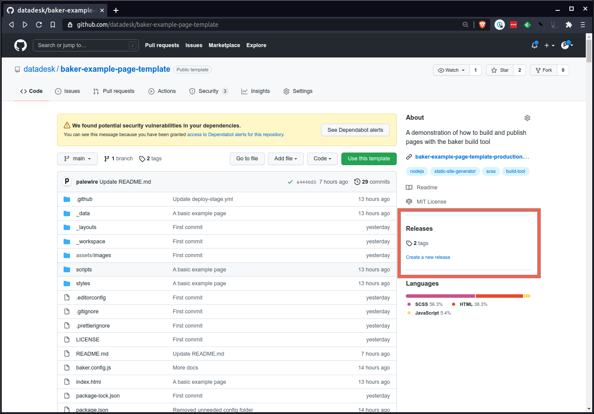
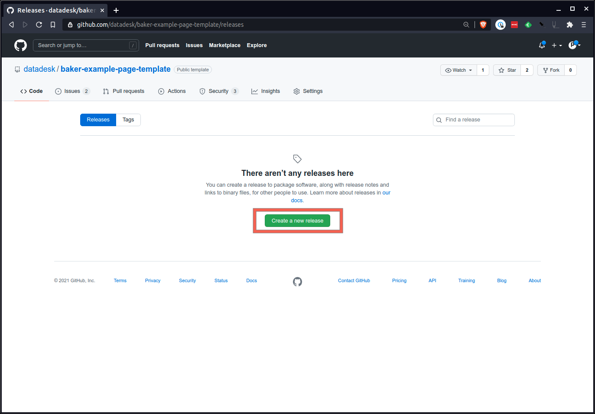
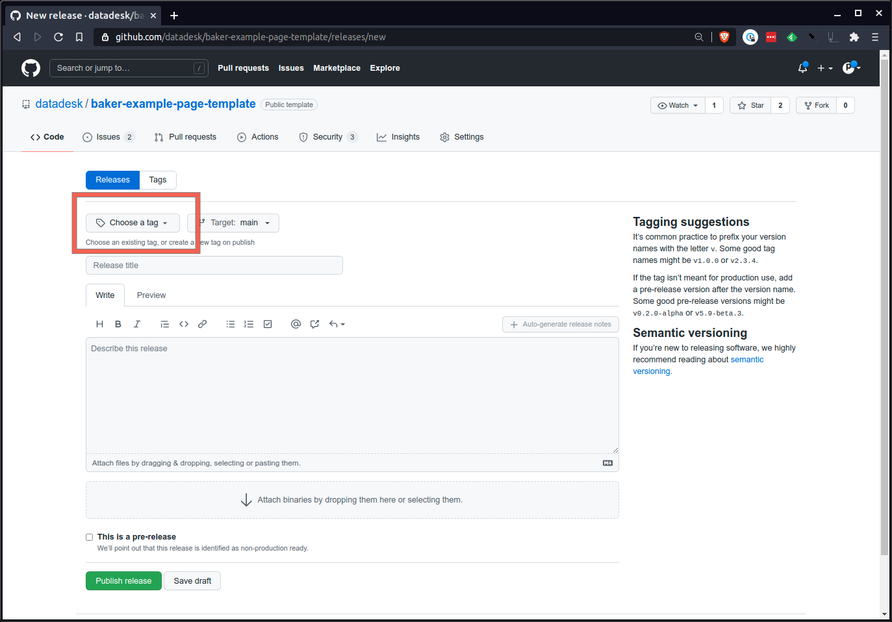
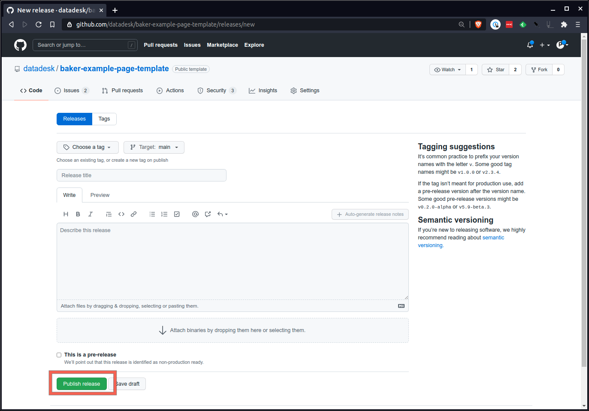

# baker-example-page-template

A demonstration of how to build and publish pages with the [baker](https://github.com/datadesk/baker) build tool.

The Los Angeles Times uses baker to create the static pages published at latimes.com/projects. The Times system relies on a private version of a repository much like this one. This simplified example publishes [staging](http://baker-example-page-template-staging.s3-website-us-east-1.amazonaws.com/baker-example-page-template/main/) and [production](http://baker-example-page-template-production.s3-website-us-east-1.amazonaws.com/baker-example-page-template/) versions to public buckets on Amazon S3. 

## Features

- 🔃 Live-updating local test server
- 🖨️ HTML templating with [Nunjucks](https://mozilla.github.io/nunjucks/)
- 🖌️ Extended CSS with [Sass](https://sass-lang.com/)
- 🗞️ JavaScript bundling with [Rollup](https://www.rollupjs.org/guide/en/) and [Babel](https://babeljs.io/) 
- 🔢 Data imports with [quaff](https://github.com/rdmurphy/quaff)
- 🥞 Dynamic page generation based on structured inputs
- 🏭 Automatic deployment of each branch to a staging environment on each `push` event via [GitHub Action](https://github.com/datadesk/baker-example-page-template/actions/workflows/deploy-stage.yml)
- 🌎 Push button deployment to the production environment on each `release` event via [GitHub Action](https://github.com/datadesk/baker-example-page-template/actions/workflows/deploy-prod.yml)
- 🔔 Slack messages that relay each deployment's status via [datadesk/notify-slack-on-build](https://github.com/datadesk/notify-slack-on-build) Github Action

## Requirements

* [Node.js](https://nodejs.org/en/) version 12, 14 or 16, though at minimum 12.20, 14.14, or 16.0.
* [Node Package Manager](https://www.w3schools.com/whatis/whatis_npm.asp)
* [git](https://git-scm.com/)

# Documentation

With a little configuration, you can use this template to easily publish a page. With a little customization, you can make it look any way you'd like. This guide will introduce you to the basics.

## Table of Contents

- [Creating a new page](#creating-a-new-page)
- [Exploring the repository](#exploring-the-repository)
- [Accessing assets](#accessing-assets)
- [Accessing data](#accessing-data)
- [Dynamic pages](#dynamic-pages)
- [Deployment](#deployment)
- [Global variables](#global-variables)
- [baker.config.js](#bakerconfigjs-1)

## Creating a new page

The first step is to click GitHub’s “use this template” button to a make a copy of the repository for yourself.


You’ll be asked to provide a slug for your project. Once that’s done, a new repository will be available at `https://github.com/your-username/your-slug`.

Next you’ll need to clone it down to your computer to work with the code.

Open up your terminal and cd to your code folder. Clone the project into your folder. This will copy the project onto your computer.

```sh
git clone https://github.com/your-username/your-slug
```

If that command doesn’t work for you, it could be because your computer was set up differently and you need to clone to the repository using SSH. Try running this in your terminal:

```sh
git clone git@github.com:your-username/your-slug.git
```

Once the repository has finished downloading, cd into your-slug and install the Node.js dependencies.

```sh
npm install
```

Once the dependencies have been installed, you’re ready to preview the project. Run the following to start the test server.

```sh
npm start
```

Now go to `localhost:3000` in your browser. You should see a boilerplate page ready for your customizations.

### Starting with bluprint

An alternative route is to create a new page with [bluprint](https://github.com/reuters-graphics/bluprint), the command-line scaffolding tool developed by the Reuters graphics department.

```bash
bluprint add https://github.com/datadesk/baker-example-page-template
mkdir my-new-page
cd my-new-page
bluprint start baker-example-page
```

## Exploring the repository

Here are the standard files and folders that you’ll find when you clone a new project from our page template. You’ll spend more time working with some files than others, but it’s good to have a general sense of what they all do.

### _data

The data folder contains relevant data for the project. We use this folder to store required information about every project — like what URL it should live at. You can also store a variety of other data types here, including `.aml`, `.csv`, and `.json`.

#### meta.aml

The `meta.aml` file contains important information about the page such as the headline, byline, slug, publication date and other fields. Filling it out ensures that your page displays correctly and can be indexed by search engines. A full list of all the attributes can be found in our reference materials. You can expand this to include as many, or as little, options as you'd like.

### _layouts

This folder that stores our site’s base template and reusable code snippets. When you’re starting out, you’re unlikely to change anything here. In more advanced use cases, it’s where you can store code that is reused across multiple pages. 

#### `base.html`

The base.html file contains all the fundamental HTML found on every page we create. The example here is rudimentary by design. You'd likely want include a lot more in a real-world implementation.

### _workspace

The workspace is a place for you to put anything relevant to the project that doesn’t need to be published on the web. AI files, bits of code, writing, etc. It’s up to you.

### assets

This is used to store media and other assets such as images, videos, audio, fonts, etc. They can be pulled into the page via the `static` template tags.

### scripts

JavaScript files are stored in this folder. The main file for JavaScript is called `app.js`, which you can write your code directly. Packages installed via `npm` can be imported and run like any other Node.js script. You can create other files to write your JavaScript code in this folder, but you must make sure that the file is booted from `app.js`.

### styles

Our stylesheets are written in SASS, a powerful stylesheet language that gives developers more control over CSS. If you’re not comfortable with SASS, you can write plain CSS into the stylesheets.

The styles folder consists of a stylesheet (`app.scss`) where you can add all of your styles custom to your project, though sometimes you might want to make additional stylesheets and import them into `app.scss`. This example project only include the bare minimum necessary simulate a simple site. You'd likely want to start off with a lot more in a real world implementation.

### baker.config.js

The `baker.config.js` file is where we put options that Baker uses to serve and build the project. It has been fully documented elsewhere in this file. With the exception of the `domain` setting, only advanced users will need to change this file.

### index.html

The default template for your page. This is where you will lay out your page. It uses the Nujucks templating system to create HTML.

### package.json,  package-lock.json

These files track the Node dependencies used in our projects. When you run `npm install` the libraries you add will be automatically tracked here for you.

### .github

This is a special directory for storing files that GitHub uses to interact with our projects and code. The `.github/workflows` directory contains the GitHub Action that handles our development deployments. You do not need to edit anything in here.

## Accessing assets

Files stores in the assets directory are optimized and hashed as part of the deployment process. To ensure that your references to images and other static files, you should use the `` tag. That ensures the file is heavily cached when it’s published and that the link to the image works across all environments. You’ll want to use it for all photos and videos.

```jinja
<figure>
  
</figure>
```

## Accessing data

Structrued data files stored in your `_data` folder are accessible via templatetags or JavaScript. In this demonstration, a file called `example.json` has been included to illustrate what's possible. Other file formats like CSV, YAML and AML are supported.

### Via Nunjucks templatetags

Files in the `_data` folder are available by their name within your templates. So, with `_data/example.json`, you can write something like:

```jinja

  {{ obj.year }}: {{ obj.wheat }}

```

### Via JavaScript

A common need for anyone building a project in Baker is access to raw data within a JavaScript file. Often this data is then passed along to code written using d3 or Svelte to draw graphics or create HTML tables on the page.

If the data you’re accessing is already available at a URL you trust will stay live, this is easy. But what if it isn’t, and it is data you’ve prepared yourself?

It’s possible to access records in your _data folder. The only caveat is the job of converting this file into a usable state is your responsibility. A good library for this is `d3-fetch`.

To build the URL to this file in a way Baker understands, use this format:

```javascript
import { json } from 'd3-fetch';

// the first parameter should be the path to the file
// the second parameter *must* be “import.meta.url”
const url = new URL(‘../_data/example.json’, import.meta.url);

// Call it in
const data = await json(url);
```

Another approach is to print the data into your template as a `script` tag. The `jsonScript` filter takes the variable passed to it, runs `JSON.stringify` on it, and outputs the JSON into the HTML within a `<script>` tag with the ID set on it you pass as the parameter.

```jinja
{{ example|jsonScript('example-data') }}
```

Once that is in place, you can now retrieve the JSON stored in the page by ID in your JavaScript.

```javascript
// grab the element jsonScript created by using the same ID you passed in
const dataElement = document.getElementById('example-data');

// convert the contents of that element into JSON
// do what you need to do with “data”!
const data = JSON.parse(dataElement.textContent);
```

While the URL method is recommended, this method may still be preferred when you are trying to avoid extra network requests. It also has the added benefit of not requiring a special library to convert `.csv` data into JSON.

## Dynamic pages

You can generate an unlimited number of static pages by feeding a structured data source to the `createPages` option in the `baker.config.js` file. For instance, this snippet will generate a page for every record in the `example.json` file.

```javascript
export default {
 // ... all the other options above this one have been excluded to make the point
 createPages: createPages(createPage, data) {
    // Grab the data from the _data folder
    const pageList = data.example;
    // Loop through the records
    for (const d of pageList) {
      // Set the base template that will be used for each object. It's in the _layouts folder
      const template = 'year-detail.html';
      // Set the URL for the page
      const url = `${d.year}`;
      // Set the variables that will be passed into the template's context
      const context = { obj: d };
      // Use the provided function to render the page
      createPage(template, url, context);
    }
  },
};
```

That could be used to create URLs like `/baker-example-page-template/1775/` and `/baker-example-page-template/1780/]` with a single template. 

## Deployment

### Configuring your account

Before you can deploy a page created by this repository, you will need to configure your Amazon AWS account and add a set of credentials to your GitHub account.

First, you'll need to create two buckets in Amazon's S3 storage service. One is for your staging site. The other is for your production site. For this simple example, each should allow public access and be [configured to serve a static website](https://docs.aws.amazon.com/AmazonS3/latest/userguide/HostingWebsiteOnS3Setup.html). In a more sophisticated arragenment, like the one we run at the Los Angeles Times, the buckets could be linked with registered domain names and the staging site shielded from public view via an authentication scheme.

The names of those buckets should then be stored as GitHub "secrets" accessible to the Actions that deploy the site. You should visit [your settings panel for your account or organization](https://docs.github.com/en/actions/security-guides/encrypted-secrets#creating-encrypted-secrets-for-an-organization). Start by adding these two secrets.

|Name|Value|
|:---|:----|
|`BAKER_AWS_S3_STAGING_BUCKET`|The name of your staging bucket|
|`BAKER_AWS_S3_STAGING_REGION`|The S3 region where your staging bucket was created|
|`BAKER_AWS_S3_PRODUCTION_BUCKET`|The name of your production bucket|
|`BAKER_AWS_S3_PRODUCTION_REGION`|The S3 region where your production bucket was created|

Next you should ensure that you have an key pair from AWS that has the ability to upload public files to your two buckets. The values should also be added to your secrets.

|Name|Value|
|:---|:----|
|`BAKER_AWS_ACCESS_KEY_ID`|The AWS access key|
|`BAKER_AWS_SECRET_ACCESS_KEY`|The AWS secret key|

### Staging your work

[A GitHub Action](https://github.com/datadesk/baker-example-page-template/actions/workflows/deploy-stage.yml) included with this repository will automatically publish a staging version for every branch. For instance, code pushed to the default `main` branch will appear at `https://your-staging-bucket-url/your-repo/main/`.

If you were to create a new git branch called `bugfix` and push your code, you would soon see a new staging version at `https://your-staging-bucket-url/your-repo/bugfix/`.

### Publishing your work

Before you send your page live, you should settle on a final slug for the URL. This will set the subdirectory in your bucket where the page will be published. This feature allows The Times to publish numerous pages inside the same bucket with each page managed by a different repository.

Step one is to enter the slug for your URL into the `_data/meta.aml` configuration file.

```yaml
slug: your-page-slug
```

It’s never a bad idea to make sure your slug hasn’t already been taken. You can do that by visiting `https://your-production-bucket-url/your-slug/` and ensuring it returns a page not found error.

If you want to publish your page at the root of your bucket, you can leave the slug null.

```yaml
slug:
```

Next you commit your change to the configuration file and make sure it’s pushed to the main branch on GitHub.

```bash
git add _data/meta.aml
git commit -m “Set page slug”
git push origin main
```

Visit the releases section of your repository’s page on GitHub. You can find it on the repo’s homepage.



Draft a new release.



There you’ll create a new tag number. A good approach is to start with an x.x.x format number that follows [semantic versioning](https://semver.org/) standards. 1.0.0 is a fine start.



Finally, hit the big green button at the bottom and send out the release.



Wait a few minutes and your page should show up at `https://your-production-bucket-url/your-slug/`.

## Debugging

The baker test server can log with greater detail by starting with the following option.

```sh
DEBUG=1 npm start
```

To limit the logs to baker run:

```sh
DEBUG=baker:* npm start
```

If your build is unsuccessful, you can try creating the static site yourself locally via your terminal. If there are errors with the page building, they will be printed out to your terminal.

```sh
npm run build
```

## Global variables

Baker comes with a set of global variables that are the same on every page it creates, and another set of page-specific variables that are set based on the current page being created. You can use these variables to conditionally add content to pages or filter out unrelated data based on the current page.

### `NODE_ENV`

The `NODE_ENV` variable will always be one of two values: `development` or `production`. It corresponds to what type of build is being run on the page.

When you run `npm start`, you are in `development` mode. When you run `npm run build`, you are in `production` mode.

This is most useful for adding things to pages only when you’re in `development` mode.

```jinja

<p>You’ll never see this on the live site!</p>

```

### `DOMAIN`

The `DOMAIN` variable will always be the same as the `domain` option passed in `baker.config.js`, or an empty string if one was not passed.

### `PATH_PREFIX`

The `PATH_PREFIX` variable will always be the same as the `pathPrefix` option passed in `baker.config.js`, or a single forward slash (`/`) if one was not passed.


### `page.url`

The project-relative URL to the current page. Will include the `pathPrefix` if one was provided in the `baker.config.js` file — in other words, it will account for any project pathing being done and point at the correct page in the project.

### `page.absoluteUrl`

The absolute URL to the current page. This combines the `domain`, `pathPrefix` and current path into a full URL. This is currently used to output the canonical URL and all URLs for social `<meta>` tags.

```jinja
<link rel="canonical" href="{{ page.absoluteUrl }}">
```

### `page.inputUrl`

This is the path to the original template used to create this page relative to the current project’s directory. If you have an HTML file located at `page-two/index.html`, `page.inputUrl` would be `page-two/index.html`.

### `page.outputUrl`

This is the path to the HTML file that was output to create this page relative to the `_dist` folder. If you have an HTML file located at `page-two.html`, `page.outputUrl` would be `page-two/index.html`.

## baker.config.js

Every Baker project we work on includes a `baker.config.js` file in the root directory. This file is responsible for passing information to Baker so it can correctly build your project.

```javascript
export default {
  // the directory where assets are
  assets: ‘assets’,

  // createPages
  createPages: undefined,

  // the data directory
  data: ‘_data’,

  // an optional custom domain to be used in building paths
  domain: undefined,

  // a path or glob of paths of each JavaScript entrypoint
  entrypoints: ‘scripts/app.js’,

  // the overall input directory, typically the current folder
  input: process.cwd(),

  // where the template layouts, macros and includes are located
  layouts: ‘_layouts’,

  // an object with the keys and values of global variables to be
  // passed to all Nunjucks templates
  nunjucksVariables: undefined,

  // an object of key (name) + value (function) for adding custom
  // filters to Nunjucks
  nunjucksFilters: undefined,

  // an object of key (name) + value (function) for adding custom
  // tags to Nunjucks
  nunjucksTags: undefined,

  // where to output the compiled files
  output: ‘_dist’,

  // a prefix to add to the beginning of every resolved path, how
  // slugs work
  pathPrefix: ‘/’,

  // an optional directory to put all assets within, rarely used
  staticRoot: ‘’,
};
```

### Options


#### assets

default: `”assets”`

This tells Baker which folder to treat as the assets directory. You likely do not have to change this.

#### createPages

default: `undefined`

`createPages` is an optional parameter that makes it possible to dynamically create pages using data and templates in the project.

```javascript
export default {
  // …

  // createPage - pass in a template, an output name, and the data context
  // data - the prepared data in the `_data` folder
  createPages(createPage, data) {
    for (const title of data.titles) {
      createPage('template.html', `${title}.html`, {
        context: { title },
      });
    }
  },
};
```

#### data

default: `”_data”`

The `data` option tells Baker which folder to treat as its data source. You likely will not need to change this. 

#### domain

default: `undefined`

The `domain` option tells Baker what to use when it builds absolute URLs. The `bakery-template` presets this to `https://www.latimes.com`.

#### entrypoints

default: `”scripts/app.js”`

The `entrypoints` option tells Baker what JavaScript files to treat as starting points for script bundles. This can be a path to a file or a file glob, making it possible to create multiple bundles at the same time.

#### input

default: `process.cwd()`

The `input` option tells Baker what folder to treat as the main directory for the entire project. By default this is the folder the `baker.config.js` file is in. You likely will not need to set this.

#### layouts

default: `”_layouts”`

The `layouts` option tells Baker where the templates, includes and macros are located. By default this is the `_layouts` folder. You likely will not need to set this.

#### nunjucksFilters

default: `undefined`

You can use `nunjucksFilters` to pass in your own custom filters. In the object each key is the name of the filter, and the function value is what is called when you use the filter.

```javascript
export default {
  // ...

  // pass an object of filters to add to Nunjucks
  nunjucksFilters: {
    square(n) {
      n = +n;

      return n * n;
    }
  },
}
```

```jinja
{{ value|square }}
```

#### nunjucksTags

default: `undefined`

You can use `nunjucksTags` to pass in your own custom tags. These differ from filters in that they make it easier to output blocks of text or HTML.

```javascript
export default {
  // ...

  // pass an object of filters to add to Nunjucks
  nunjucksTags: {
    doubler(n) {
      return `<p>${n} doubled is ${n * 2}</p>`;
    }
  },
};
```

```jinja

```

#### output

default: `”_dist”`

The `output` option tells Baker where to put files when `npm run build` is run. By default this is the `_dist` folder. You likely will not need to set this.

#### pathPrefix

default: `”/”`

`pathPrefix` tells Baker what path prefix to add to any URLs it builds. If `domain` is also passed, it will be combined with `pathPrefix` when building absolute URLs. You typically will not set this manually — it is used during deploys for building URLs with project slugs.

#### staticRoot

default: `””`

The `staticRoot` option instructs Baker to put all assets in an additional directory. This is useful for projects that need to have unique slugs across every single page without nesting, allowing them to all share static assets. However — this is a special case and requires a custom setup for deployments. Do not attempt to use this without a good reason.
